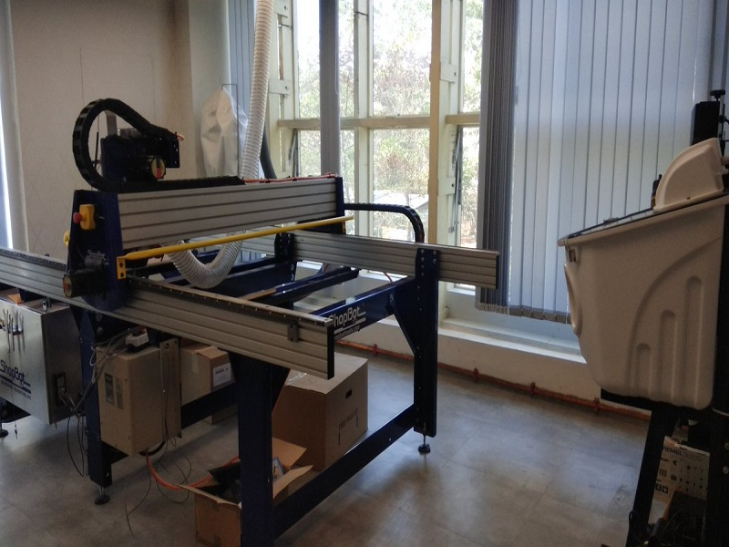
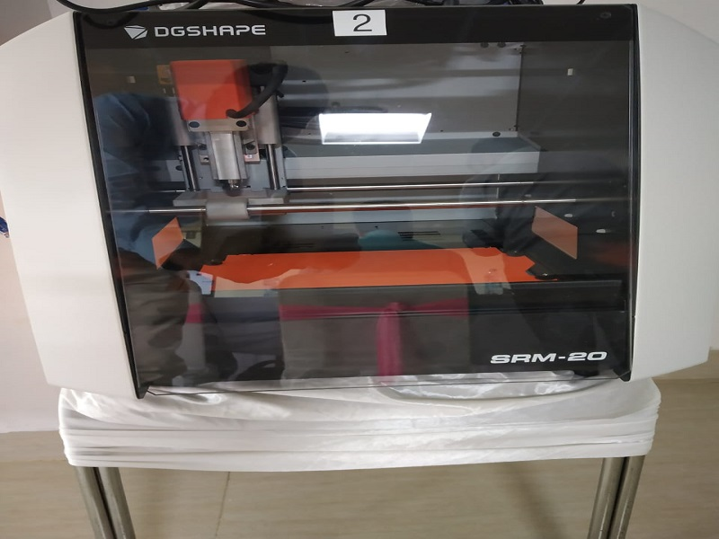
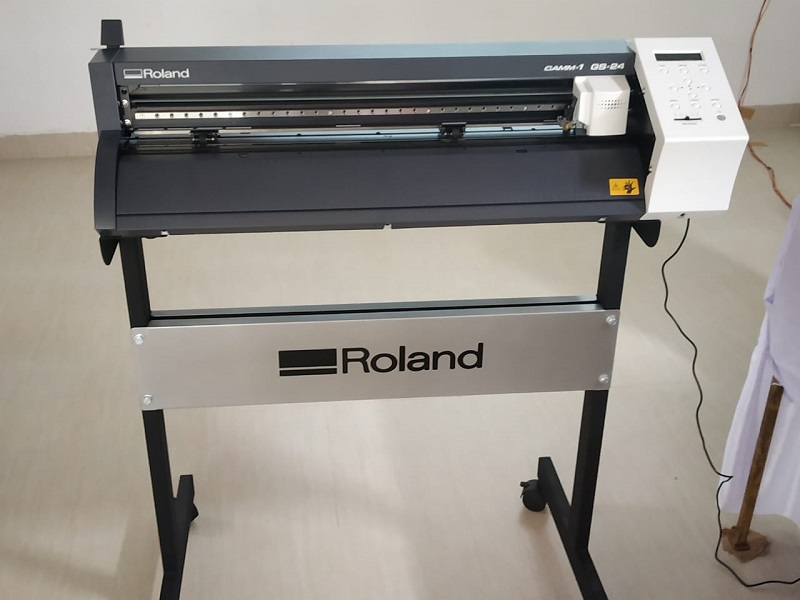
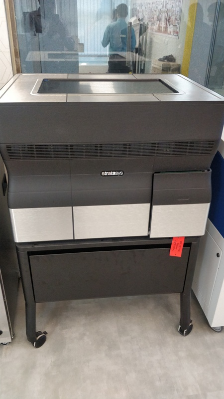

*My Three weeks drive at Pre-Fab Academy Training Program at STPI-Bhubanewar Campus.*  
*We are trained by two legends Sh.Fransisco & Sh.Sibu*
             
***Introduction***     
*A Fab Lab (Fabrication Laboratory)  is a small workshop offering personal digital fabrication.The fab labs are equipped with an array of CNC(Computer Controlled Machines) that help you to get a prototypes  [*more...*](/md-files/Introduction.md)

 [*Inaugural Session*](/md-files/Inauguration.md)

 [*Fablab Tour*](/md-files/fablabvisit.md)

**Shopbot Machine**

First we had a brief demo on shopbot(subtractive model) Machine. It is a Computer Numerical Control(CNC) milling tool. It is 3axis cutter and used for wooden materials and aluminium .Safety is very important when using this machine. During emergency, hit the stop button.Always it is recommended to have one more person while working with this machine.

This machine will work smoothly for more than ten years. If power goes off then it is almost like loss of work for beginners. Next, we had a demo on W-band-saw tool. It is works like a hacksaw blade cutter. It is not a flexible cutter which means difficult to cut curved patterns. The next tool is scroll saw.It is works like a hacksaw blade cutter but more flexible.

**Cleaning Tool** cleaning tool which cleans support stressor(clay).  

**Micro-Milling-Mahine** 
      
Micro milling machine whose resolution is 100th inches. The commonly used diameter is 0.4mm, 0.8mm up to 6mm. Fiber class is not to be used.

We had a quick look at oscilloscope, power supply, functional generate, epilog laser. 

**vinyl cutter**-   

      
 It acts like plotter, draw images and act like stencil and screen printer.  

**Laser Cutter** 

  

lacer cutter engraving, 3D structures. 80W Co2 laser, 10.2 micro meter. In this machine we can't to use metal. Because it produce the smoke. We had a brief look at Air filter which sucks dust particles but gases will remain. Don't open immediately after using laser cutter. Don't cut anything very thin like paper and glass cutting is not permitted but engraving is permitted.

**3D Printer** 

 

3D printers(Additive). Which is a single material printer. i.e fused filament deposit, UV curable which is a stereo lithography polymerization. Injective 3D printer-STRATASOS which can support two materials.

Then back to session where we learnt about documentation and created a new account and started creative new repository

## Day-2 Summary (Date:19.03.2019) 11.30AM
     
Installed the softwares spell checker, inkscope and cura   
 **Spell Checker** - Used to spell check in visual code   
 **inkscope** - Inkscape is professional quality vector graphics software   
 **Cura** - Advanced 3D Printing Software   

Mentor Mr.Franscisco, explained how the files and photos are uploaded in to the fabzero login.i.e. portal. The text file in the Visual Studio Code should be commit with the message.Every time this process is required when the changes are made in the text file.

Downloaded and installed the Git for Windows OS for using git:clone command in Visual Studio Code.After installed, open the Visual Studio Code and type Ctrl+Shift+P and enter git:clone and paste the repository link which is obtained from the portal and folder to be select for repository clone.

Now, we can upload the README.md(text file) from Visual Studio Code. i.e open the txt file through Visual Studio and modify as it required and commit the changes and hit the push command, Now the modified file is uploaded in to the portal.
